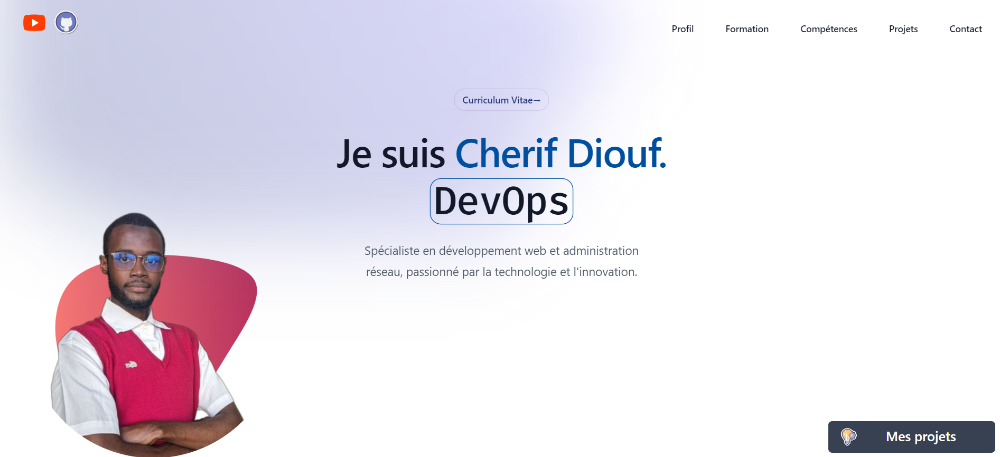

# Cherif Diouf - Portfolio

Bienvenue sur le repository de mon portfolio personnel. Ce projet met en avant mon parcours, mes compétences, et mes projets en tant que développeur Full Stack spécialisé dans les technologies web et télécommunications.

Mon portfolio est conçu pour offrir une expérience utilisateur fluide et immersive, permettant à quiconque de découvrir mes réalisations, mes compétences techniques et ma formation. Vous y trouverez également des informations sur les projets sur lesquels j'ai travaillé, ainsi que mes coordonnées.

## 🎯 Objectif

Le but de ce portfolio est de montrer mes compétences, mon expertise et les divers projets que j'ai développés. Il sert de vitrine en ligne pour toute personne ou organisation souhaitant en savoir plus sur mon travail et mes capacités en développement logiciel.

## 🌐 Accès

Vous pouvez consulter la version en ligne de mon portfolio via le lien suivant :

👉 [Visiter mon portfolio](https://cherif-diouf.me/)

## 📂 Contenu

Mon portfolio contient les sections suivantes :

- **Profil** : Un aperçu de mon parcours et de ma mission en tant que développeur Full Stack.
- **Formation** : Mes diplômes et distinctions académiques dans le domaine de l'ingénierie logicielle et des réseaux.
- **Compétences** : Un récapitulatif de mes compétences techniques, avec une section dédiée aux langages de programmation et frameworks.
- **Projets** : Une présentation de mes principaux projets, chacun avec une description détaillée et des visuels pour illustrer mon travail.
- **Contact** : Les moyens de me contacter directement pour discuter de potentielles collaborations.

## 💼 Technologies utilisées

Ce projet a été conçu en mettant l'accent sur la performance et la modernité. Il intègre des technologies web modernes pour offrir une expérience utilisateur optimale, notamment en termes de réactivité et d'accessibilité.

---

Merci de visiter mon portfolio. Si vous souhaitez collaborer ou discuter de mes projets, n'hésitez pas à me contacter via les informations fournies dans la section "Contact". 😊

